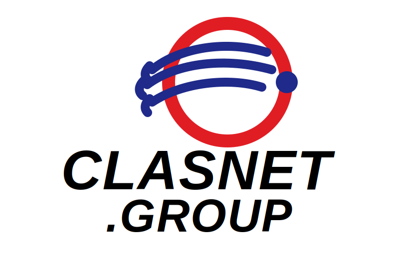

<p align="center">
  
</p>

# Portal Pondokrejo

Portal Pondokrejo adalah aplikasi web yang berfungsi sebagai pengumpul API (API aggregator) untuk menyajikan informasi publik dari berbagai sistem milik Kalurahan Pondokrejo. Portal ini tidak menjadi sumber data utama dan tidak menyimpan data konten ke database internal; konten ditampilkan dari layanan upstream yang relevan.

## Tujuan
- Menyediakan satu pintu akses informasi publik yang konsisten, cepat, dan mudah diakses.
- Mengurangi duplikasi implementasi antarmuka dengan memusatkan konsumsi API dari sistem yang sudah ada.
- Menjadi lapisan presentasi (presentation layer) dan integrasi (integration layer) bagi layanan yang berbeda.

## Sumber Data
Portal mengambil data dari beberapa layanan, antara lain:
- OpenSID (arsip/berita, wilayah, PPID, keuangan, dan endpoint internal lain yang relevan)
- SDGs
- IDM
- Sistem/layanan internal lain yang dipublikasikan melalui API

## Cara Kerja (Ringkas)
- Aplikasi client dan server memanggil route internal `app/api/*` sebagai antarmuka terpadu.
- Untuk beberapa sumber eksternal, portal menyediakan proxy untuk menghindari masalah CORS dan menambahkan caching.
- Konten ditampilkan secara on-demand dari sumber upstream, dengan mekanisme cache/revalidate sesuai kebutuhan.

## Prasyarat
- Node.js dan npm
- Environment variables (lihat `.env.example`)

## Menjalankan Lokal
```bash
npm install
npm run dev
```

Buka: http://localhost:5091

## Build dan Menjalankan Production
```bash
npm run build
npm run start
```

## Konfigurasi Environment (Umum)
- `OPENSID_API_URL`: base URL OpenSID (jika diperlukan)
- `NEXT_PUBLIC_SITE_URL`: base URL portal (untuk produksi)
- `CORS_ORIGIN`: origin yang diizinkan mengakses API portal
- `RATE_LIMIT_WINDOW_MS`, `RATE_LIMIT_MAX`: konfigurasi rate limiting route `/api`

## Keterangan Data Pribadi
Portal Pondokrejo tidak melakukan pengumpulan, perekaman, maupun penyimpanan data pribadi pengguna secara mandiri. Portal ini berfungsi sebagai media penyajian informasi yang bersumber dari sistem/layanan upstream milik Kalurahan Pondokrejo. Dengan demikian, kewajiban pengelolaan dan pemenuhan ketentuan perlindungan data pribadi melekat pada sistem sumber sesuai kewenangan dan kebijakan masing-masing. Portal Pondokrejo tetap menerapkan pengamanan teknis yang wajar untuk menjaga integritas layanan.

## Keamanan dan Operasional
- Security headers dan Content Security Policy (CSP) dikonfigurasi global di `next.config.ts`.
- CORS distandarkan untuk route API utama melalui helper internal dan dibatasi oleh konfigurasi environment.
- Rate limiting diterapkan pada route `/api` melalui `middleware.ts`.
- Ringkasan audit fix terbaru tersedia di [AUDIT_FIX_LATEST.md](./AUDIT_FIX_LATEST.md).

---

## 🔐 Pembaruan Keamanan — Pentest VULN-01 s/d VULN-08

> **Tanggal perbaikan:** 11 Juni 2026 · Commit `aaa2700`

Berikut ringkasan perbaikan hasil penetration testing (pentest) yang telah diterapkan:

### VULN-01 — Redirect ke Pengaduan Eksternal (Unvalidated Redirect)
Seluruh tautan `/pengaduan` internal dialihkan ke sistem pengaduan resmi OpenSID:
`https://pondokrejo.sleman-desa.id/index.php/pengaduan`
Halaman internal `/pengaduan` beserta komponen `PengaduanDisplay` dihapus untuk menghilangkan permukaan serangan formulir yang tidak divalidasi.

### VULN-02 — Halaman & API Pengaduan Internal Dihapus
Route `app/api/pengaduan/route.ts` dan halaman `app/pengaduan/page.tsx` dihapus sepenuhnya (~170+ baris). Fungsionalitas pengaduan diserahkan ke sistem upstream (OpenSID).

### VULN-03 — Metadata URL Hardcoded (Information Disclosure)
URL produksi di `app/layout.tsx` diperbarui dari domain lama (`pondokrejo.clasnet.co.id`) ke domain resmi (`devoneclickpondokrejo.slemankab.go.id`) untuk menghindari kebocoran informasi infrastruktur internal.

### VULN-04 — Rate Limiting Header Tidak Transparan
Middleware rate limiting diperbarui untuk menyertakan header standar RFC:
- `X-RateLimit-Limit` — batas maksimum request per window
- `X-RateLimit-Remaining` — sisa request yang diizinkan
- `X-RateLimit-Reset` — waktu reset dalam Unix timestamp

Header ini disertakan baik pada respons normal maupun respons `429 Too Many Requests`.

### VULN-05 — Navigasi Header Tidak Membedakan Link Eksternal
Link **Pengaduan** di `Header.tsx` dan `MobileNavigation.tsx` tidak ditandai sebagai eksternal, sehingga membuka tautan di tab yang sama tanpa `noopener noreferrer`. Kini semua link eksternal menggunakan:
```html
target="_blank" rel="noopener noreferrer"
```

### VULN-06 — API Peta Tanpa Validasi Input
`app/api/peta/route.ts` diperbarui dengan validasi dan sanitasi parameter query agar tidak meneruskan input mentah ke upstream.

### VULN-07 — API SDGs Detail Tanpa Pembatasan Akses
`app/api/sdgs/detail/[goal]/route.ts` diperbarui dengan penanganan error yang lebih ketat dan pembatasan response untuk mencegah eksposur data yang tidak diperlukan.

### VULN-08 — Link Pengaduan di Footer Tanpa Atribut External
`components/layout/Footer.tsx` diperbarui: semua link ke sistem pengaduan eksternal kini menggunakan flag `external: true` sehingga dirender dengan atribut keamanan yang benar (`target="_blank" rel="noopener noreferrer"`).

---

> Untuk detail teknis lengkap, lihat [AUDIT_FIX_LATEST.md](./AUDIT_FIX_LATEST.md) dan [RELEASE_NOTES.md](./RELEASE_NOTES.md).

## Dokumen
- [RELEASE_NOTES.md](./RELEASE_NOTES.md)
- [AUDIT_FIX_LATEST.md](./AUDIT_FIX_LATEST.md)

<p align="center">
  
</p>
